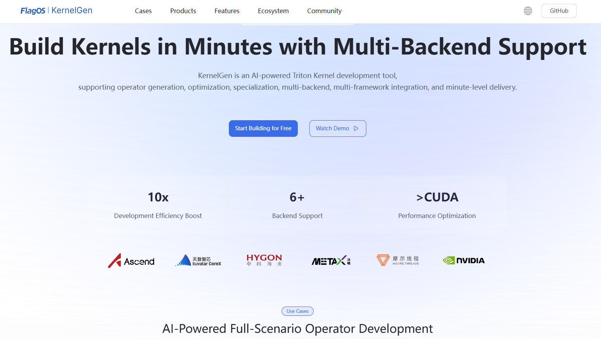
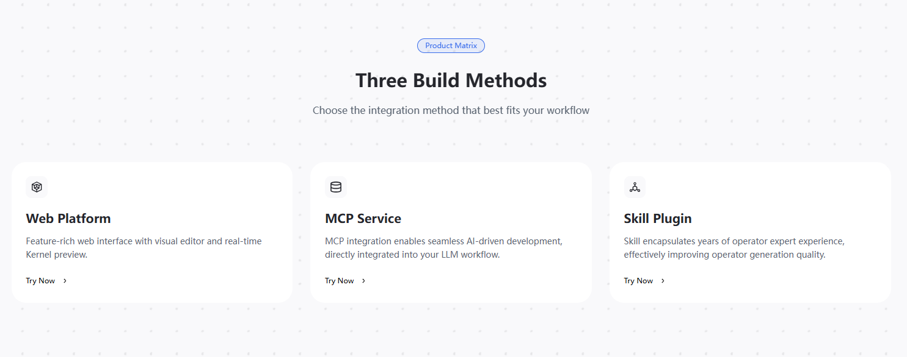

# Configure and connect to KernelGen MCP server

This section introduces how to connect to KernelGen MCP server through VS Code (and Copilot), Claude Code, and OpenClaw.

## Prerequisites

Before configuring and connecting your AI agent to the KernelGen MCP server, you must obtain a Bearer Token from the KernelGen Web Platform.

To retrieve your token, follow these steps:

1. Open [https://KernelGen.flagos.io/login](https://kernelgen.flagos.io/login) in your browser.

2. Click **Start Building for Free.**
   

3. When the page is scrolled down to the bottom, click **MCP Service**.
   

4. In the **Access Token** section on the right, click the eye icon to view the Bearer token and click **Copy** to copy it to the clipboard and save it for later use.
   
   ```{note}
   Accessing the token requires you to log in to the KernelGen Web Platform. For login steps, see Login.
   ```
   

   

   You can then use this token in the `Authorization` header of your requests as follows:

   ```{code-block} json
   Authorization: Bearer <your Token>
   ```

**Note**:

- Treat your Bearer Token as a sensitive credential. Do not share it or expose it in public repositories.

- Tokens have an expiration time. If your token has expired and you cannot connect to the KernelGen MCP Server, you can log in to the KernelGen Web Platform to copy a new one.


```{toctree}
:maxdepth: 2


vscode-connect-mcp.md
claudecode-connect-mcp.md
openclaw-connect-mcp.md
cursor-connect-mcp.md


```