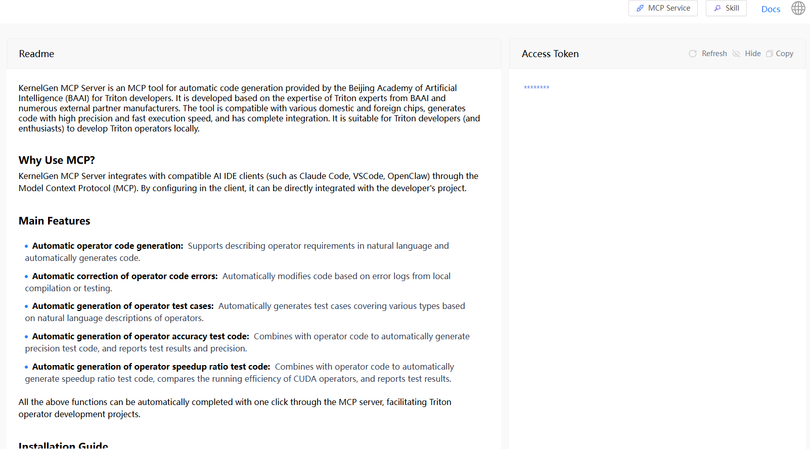

# Obtain KernelGen Token

Before configuring and connecting your AI agent to the KernelGen Operator Development MCP Toolkit, you must obtain a KernelGen Token from the KernelGen Web Platform.

To retrieve your KernelGen Token, follow these steps:

1. Open [https://KernelGen.flagos.io/login](https://kernelgen.flagos.io/login) in your browser.

2. Click **Start Building for Free.**
   

3. When the page is scrolled down to the bottom, click **MCP Service**.
   

4. In the **KernelGen Token** section on the right, click the eye icon to view the KernelGen Token and click **Copy** to copy it to the clipboard and save it for later use.

   ```{note}
   Accessing the token requires you to log in to the KernelGen Web Platform.
   ```

   

   You can then use this token when connecting your AI agent to the KernelGen Operator Development MCP Toolkit.


**Note**:

Tokens have an expiration time. If your KernelGen Token has expired and you cannot connect to the KernelGen Operator Development MCP Toolkit, you can log in to the KernelGen Web Platform to copy a new one.
