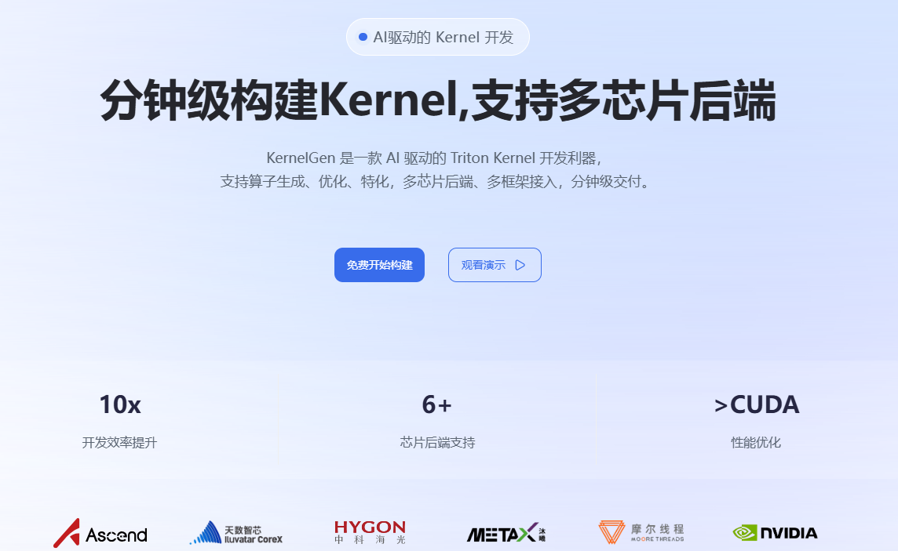
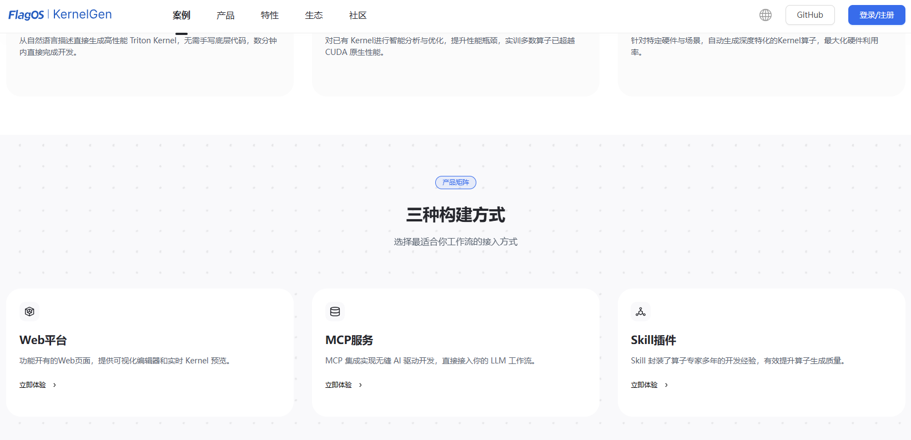

# 注册与登录

首次使用 KernelGen 的用户，请执行以下步骤：

1. 在浏览器中打开 <https://KernelGen.flagos.io/login>。
2. 点击**免费开始构建**。
   
3. 向下滚动页面至底部，点击 **Web 平台**。
   
4. 选择通过手机号或电子邮件地址注册：

    {style=lower-alpha}
    1. 在**登录/注册**对话框中，点击**手机号登录**或**邮箱登录**。

        

    2. 阅读并勾选底部的复选框，以接受**用户协议**和**隐私政策**。
    3. 输入您的手机号或电子邮件地址，然后点击**获取验证码**。
    4. 通过短信或电子邮件收到验证码后，将验证码复制并粘贴到手机号或邮箱地址下方的输入框中，然后点击**登录/注册**。
    5. 输入您的姓名、所属机构、电子邮件地址或手机号及使用目的，然后点击**提交**。

        

    欢迎页面随即打开。
