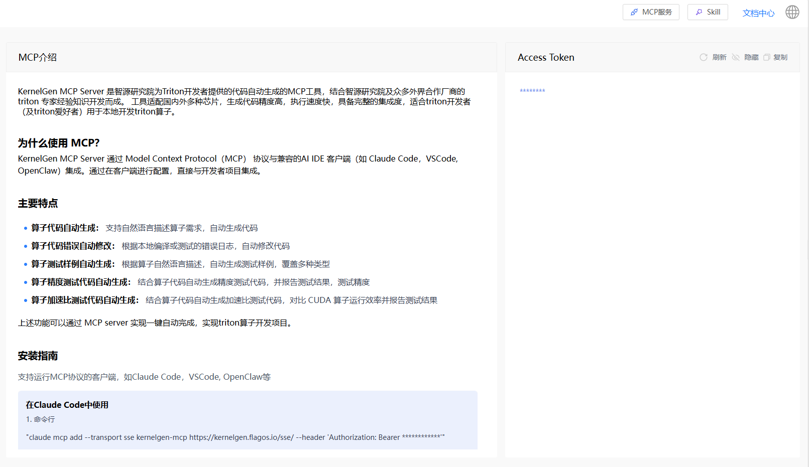

# 获取 KernelGen Token

在将 AI 智能体配置并连接到 KernelGen 算子开发 MCP 工具集之前，您需要先从 KernelGen Web 平台获取 KernelGen Token。

按照以下步骤获取 KernelGen Token：

1. 在浏览器中打开 [https://KernelGen.flagos.io/login](https://kernelgen.flagos.io/login)。

2. 点击 **Start Building for Free**。
   

3. 将页面滚动到底部，点击 **MCP Service**。
   

4. 在右侧 **KernelGen Token** 区域，点击眼睛图标查看 KernelGen Token，然后点击 **Copy** 将其复制到剪贴板并保存备用。

   ```{note}
   访问 Token 需要您登录 KernelGen Web 平台。
   ```

   

   之后您可以在将 AI 智能体连接到 KernelGen 算子开发 MCP 工具集时使用此 Token。


**注意**：

Token 具有过期时间。如果您的 KernelGen Token 已过期且无法连接到 KernelGen 算子开发 MCP 工具集，可登录 KernelGen Web 平台重新复制新的 Token。
